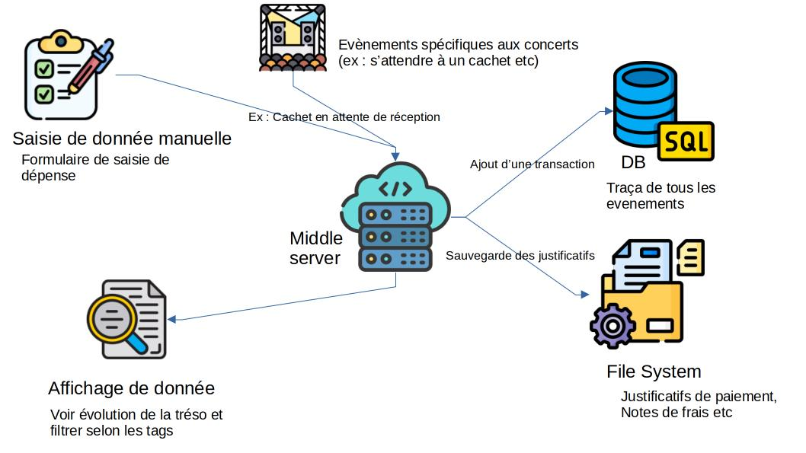

# bandcompta

- [bandcompta](#bandcompta)
  - [Archi](#archi)
  - [Model de base de donnée](#model-de-base-de-donnée)
    - [Transations](#transations)
    - [Dépense](#dépense)
    - [Recette](#recette)

## Archi

## Model de base de donnée

### Transations

Une première approche est d'avoir une table par type de transaction.
Nous pourrions aussi avoir une talbe pour toutes les transactions, mais la gestion des justificatifs de paiements peut être plus compliquée.

L'ensemble de ces table nous permetterons de calculer la trésorie.
Il suffit de faire la somme de tous les type de transaction:

$
Treso = sum(Recette) - sum(Dépense) - sum(Note de frais)
$

### Dépense

| Id          | Name  | Company | Executed | Date | PriceFullTax | PaymentMethode                       | Tag                                       | TaxAmount | InvoicePath |
| ----------- | ----- | ------- | -------- | ---- | ------------ | ------------------------------------ | ----------------------------------------- | --------- | ----------- |
| (PrmaryKey) | (str) | (str)   | (bool)   | date | (€)          | (enum/str) (ex: Virement,CB,AuBlack) | (enum/str) (ex: Transport, Fourniture...) | (%)       | (path/str)  |

Nous ajouterons une valeur à cette table à chaque fois que l'on recoît une facture.
Le but étant d'avoir un sous ensemble qui permet de resigner la dépense en donnant le fichier.
Ce fichier sera stocker sur un system de fichier géré par le serveur et son chemin sera sauvgardé dans la DB.

Selon le PaymentMethode (surtout au black) il n'y aura pas de justificatif et cela nous permetteras de filtrer.

### Recette

| Id          | Name  | Company | Received | Date | PriceFullTax | PaymentMethode                       | Tag                                       | TaxAmount | InvoicePath |
| ----------- | ----- | ------- | -------- | ---- | ------------ | ------------------------------------ | ----------------------------------------- | --------- | ----------- |
| (PrmaryKey) | (str) | (str)   | (bool)   | date | (€)          | (enum/str) (ex: Virement,CB,AuBlack) | (enum/str) (ex: Transport, Fourniture...) | (%)       | (path/str)  |

Les deux tables étant pareils, il est tout à fait faisable d'avoir un enum en plus pour savoir si c'est une dépense, une recette ou une note de frais.
